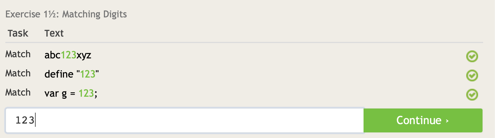
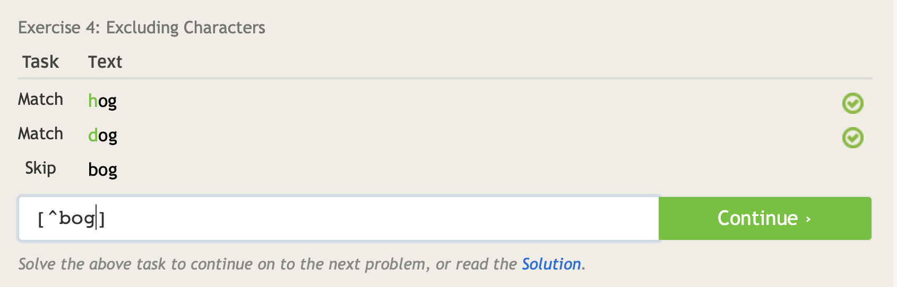
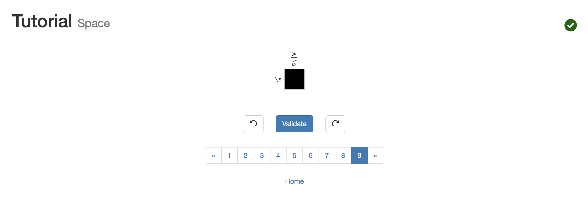

---------- Reading assignments ----------
While reading the chapter I was shocked by how such a little change to a program can lead to a potentially life changing 
lawsuit. It to me seems that the change Jesse made only made the program better.  As far as i know he didn't make it 
widely avaliable, only acessable on RPI's network. To me this seems really unfair to Jesse and the two other people 
who were changing the serch engine. While I know the supream court ruled that not knowing somthing was a crime isn't a 
admissable defense it seems a little unfair to file a multi million dollar lawsuit on a college student. What I learned 
form this article is to be careful with what programs you fork or try to update becuase it may be considered copyright 
infringment. Form this I know to be very careful when creating software or an algorithm to make sure to think out if what
I'm doing could violate anything. From this I learned that habing music delievered through a service like this could make 
you to be considered a distrubutor. Its kind of scarry to think about how you may mess up and be sued for millions of dollars
but I think being vigilant should suffice. 

---------- LINUX ---------- 

---------- REGEX ----------

--- 2 ---

1: 
1.5: 
2: 
3: 
4: 
5: 
6: 
7: 

---3a---

1: 
2: 
3: 
4: 
5: 
6: 
7: 
8: 
9: 

---3b---

1: 
2: 
3: 
4: 

---BLOCKY---

Solution: 

