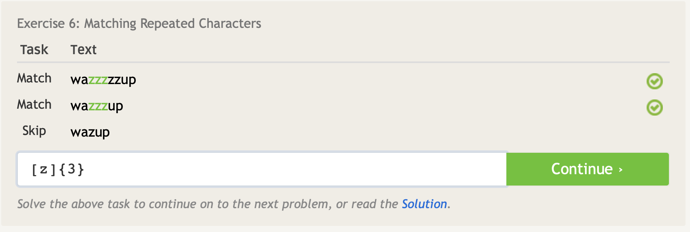
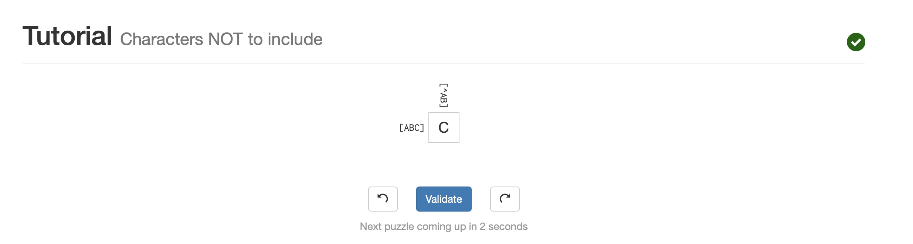
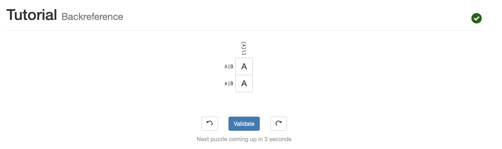

---------- Reading assignments ---------- 

While reading the chapter I was shocked by how such a little change to a program can lead to a potentially life changing 
lawsuit. It to me seems that the change Jesse made only made the program better.  As far as i know he didn't make it 
widely avaliable, only acessable on RPI's network. To me this seems really unfair to Jesse and the two other people 
who were changing the serch engine. While I know the supream court ruled that not knowing somthing was a crime isn't a 
admissable defense it seems a little unfair to file a multi million dollar lawsuit on a college student. What I learned 
form this article is to be careful with what programs you fork or try to update becuase it may be considered copyright 
infringment. Form this I know to be very careful when creating software or an algorithm to make sure to think out if what
I'm doing could violate anything. From this I learned that habing music delievered through a service like this could make 
you to be considered a distrubutor. Its kind of scarry to think about how you may mess up and be sued for millions of dollars
but I think being vigilant should suffice. 

---------- LINUX ---------- 

---------- REGEX ----------

--- 2 ---

1: 
1.5: 
2: 
3: 
4: 
5: 
6: 
7: 

---3a---

1: 
2: 
3: 
4: 
5: 
6: 
7: 
8: 
9: 

---3b---

1: 
2: 
3: 
4: 

---BLOCKY---

Solution: 

---------- REFELCTION ----------

In order to find a good opensource project that I can work on im reaching out to a bunch of friends, mostly CS, to see if they
are currently working on any projects or know nay projects that could use help. While it mostly consits of RPI CS students 
I'm going to reach out to friends at other schools, NYU, Penn, Nova and a couple of otherres to see if they have any projects
that need help. While it would be cool to help with a RCOS project I think being able to helo a project at a diffrent 
University would be really interesting too. It would for sure help a lot with learning to use git better and how to work out
coding while not at the same location which I feel would be a really usefull skill to posess. While im not sure exactly 
what I will work on, beign able to learn more about git and working on a bigger project would be a really fun time and 
a great skill to have. 
