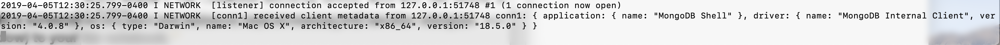
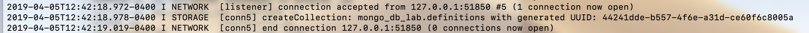
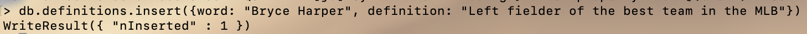
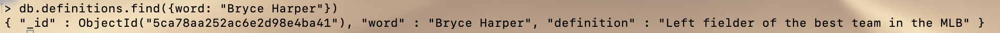
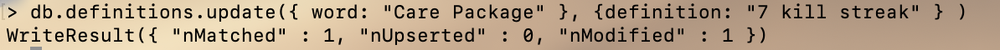
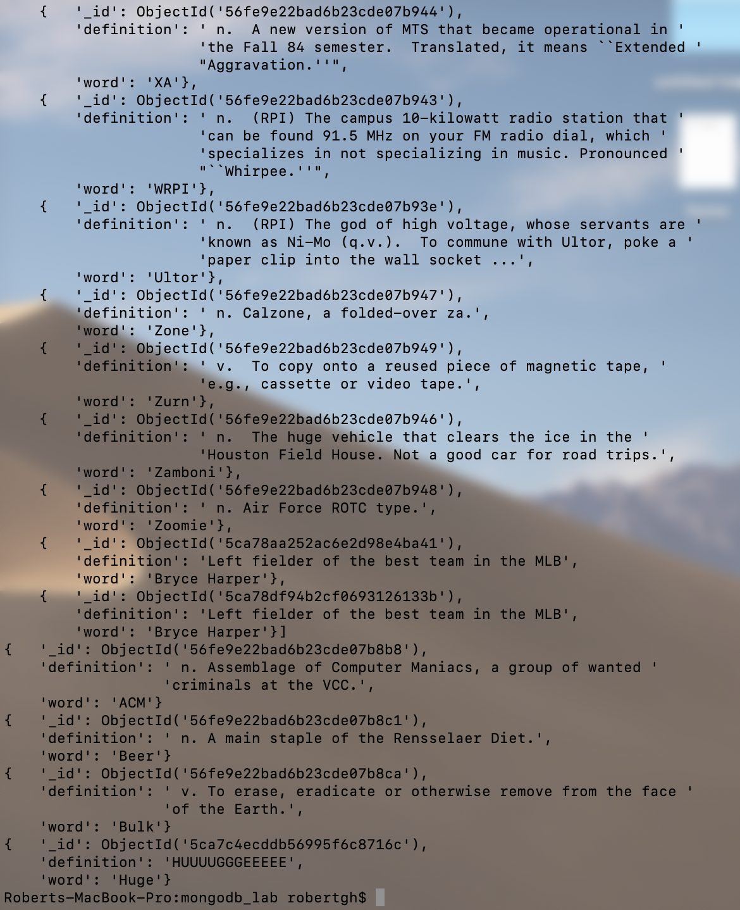
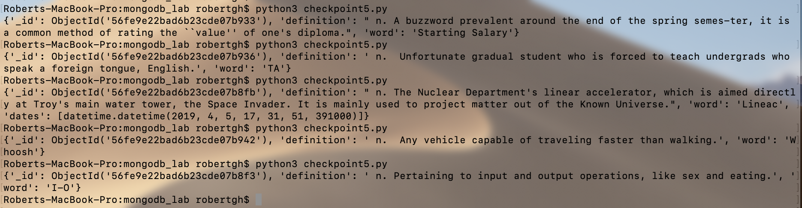

## 1


## 2


## 3
.find() returns a list of 20 definitions, and you have the option to view more
.findOne() Returns one document that satisfies the specified query criteria on the collection or view.
.find({word: "Capitaland"}) finds the word Capitaland and returns the definition of the word too
.find({_id: ObjectId("56fe9e22bad6b23cde07b8ce")}) returns the word price chopper and the definition in the dictonary






## 4 

Code:
```python
from pymongo import MongoClient
from bson.objectid import ObjectId
import pprint

client = MongoClient()

if __name__ == '__main__':
    pp = pprint.PrettyPrinter(indent=4)

    db = client["mongo_db_lab"]
    collection = db["definitions"]

    all = list(collection.find())
    pp.pprint( all )

    one = collection.find_one()
    pp.pprint( one )

    specific = collection.find_one({"word": "Beer"})
    pp.pprint( specific )

    byId = collection.find_one({"_id": ObjectId("56fe9e22bad6b23cde07b8ca")})
    pp.pprint( byId )

    insert = {"word": "Huge", "definition": "HUUUUGGGEEEEE"}
    collection.insert_one(insert)
    insertedWord  = collection.find_one({"word": "Huge"})
    pp.pprint( insertedWord )

```
Output: 


## 5 
Code:
```python
from pymongo import MongoClient
import random
import datetime
import pprint


client = MongoClient()

def random_word_requester():
    '''
    This function should return a random word and its definition and also
    log in the MongoDB database the timestamp that it was accessed.
    '''
    db = client["mongo_db_lab"]
    collection = db["definitions"]
    index = random.randint(1, collection.count() )
    word = list(collection.find())[index]
    
    collection.update_one({"word": word["word"]}, {"$push": {"dates": datetime.datetime.now()} } )
    
    
    return word


if __name__ == '__main__':
    print (random_word_requester())
```

Output:


