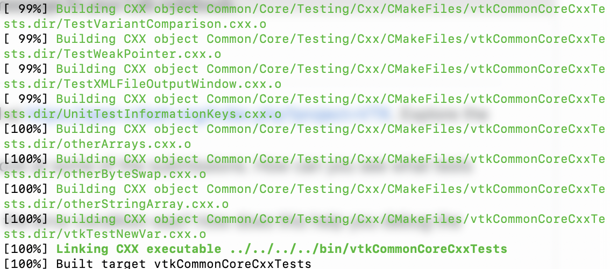
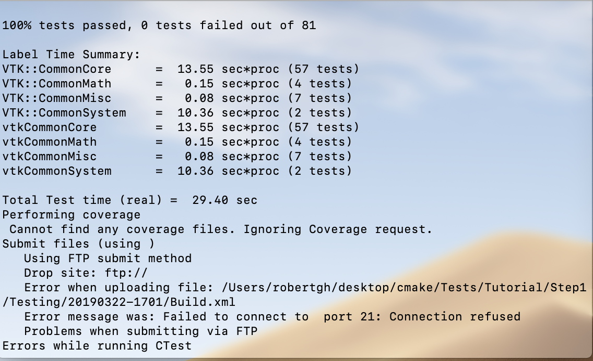

## 1
### sucessful build

## 2 
### Find the Nightly and Experimental sections and look at some of the submissions. How can you see what tests where run for a particular submission?
You can find this by clicking on the three diffrent secions, "Not Run", "Fail" and "Pass", and see which ones correspond 
to each section 

### Find a submission with errors. Can you see what the error condition was? How does this help you debug the failure?
If you click on the number of errors for a submission, if so it will give you a displaly the exit condition and message. 
This allows you to know what made the submission fail and can help you pinpoint the problem when debugging. 

### Find a system that is close to your specific configuration in the Nightly section. How clean is the dashboard? Are there any errors that you need to be concerned with?
build: Mac10.12-clang-dbg-x86_64. Only one failed test, 5 warings and no errors on build, and no errors on configure. 

### build fail

## 3

